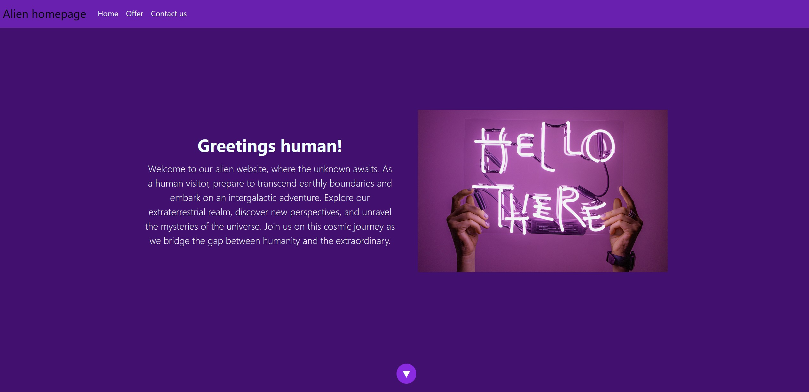

# company-website

 

This is a simple, bootstrap based, smooth-scrolling, responsive company website template. It features

- Welcome banner with a hero image
- Info cards
- Contact form
- Scrolling buttons
- Responsive nav menu

## Screenshot

## Deployment

The deployed app can be tested here: https://manonthemon.github.io/company-website

## Future development

I'd like to add:

- Some effects and animations on certain page elements (slide in cards, rotating scroll buttons).
- A pricing page
- A blogging module

## Contributors

I coded this app myself using ready bootstrap components and some ChatGPT code snippets and copy. 
For more information contact me at klimowicz.maciej@gmail.com

